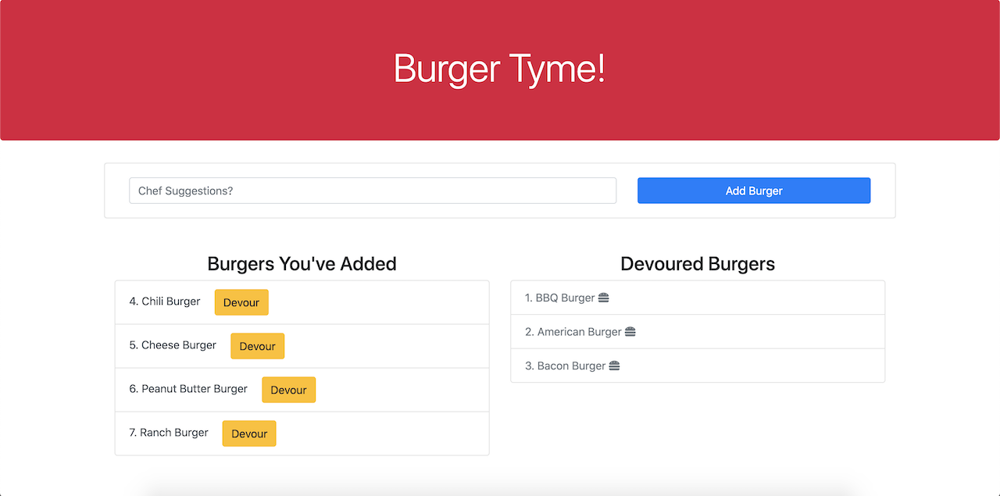

# Devour The Burger

Link to deployed site: [Devour The Burger](https://glacial-caverns-34503.herokuapp.com/)

## Description
A restaurant app that allows the user to input the names of burgers they'd like to eat. After adding the burger the user will see a list of burgers waiting to be devoured. After clicking devour, the user will see the list of burgers that have been devoured on the right hand side.

## How it works
    1. Using the MVC deisgn pattern
    2. Using Node and MySQL to query and route data
    3. Using Express to generate a server to run the back-end-code
    4. Using the homemade ORM and Connection to the MySQL DB
    5. Using Handlebars to generate the HTML.
    6. Run Application

### IMG of running app

## Credits/Technologies
    1. JavaScript/jQuery
    2. Node.js
    3. Express (Node package)
    4. MySQL Database
    5. Homemade ORM
    6. Handlebars.js
    7. HTML
    8. CSS
    9. MVC Design